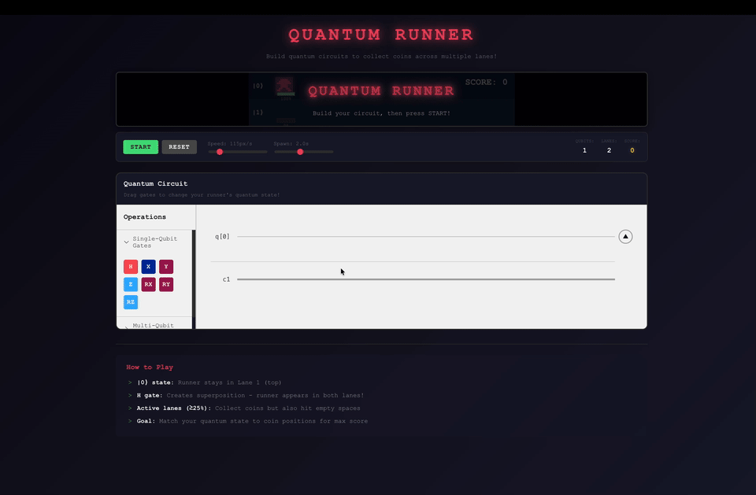

<h1 align="center">
  Qamposer
</h1>

> Qamposer is a modular, open-source quantum composer that can be embedded into your applications and runs anywhere.

## Examples

### Educational Platform

**Suitable for quantum education in schools and companies.**
An interactive quantum computing tutorial with step-by-step guidance.


### Gaming Application

**Quantum Circuit as a Controller**
Quantum mechanics and simulation results can be directly leveraged as game logic.



## Installation

> **Coming Soon** - npm package publication is in progress.

```bash
# Not yet available
npm install @qamposer/react
```

For now, please use the source code directly or contact the maintainers for access.

## Quick Start

### Basic Usage (QamposerMicro)

```tsx
import { QamposerMicro, qiskitAdapter } from "@qamposer/react";
import "@qamposer/react/styles.css";

function App() {
  return (
    <QamposerMicro
      adapter={qiskitAdapter("http://localhost:8000")}
      onSimulationComplete={(event) => {
        console.log("Result:", event.result);
        console.log("QASM:", event.qasm);
      }}
    />
  );
}
```

### Full Version with Visualization (Qamposer)

```tsx
import { Qamposer } from "@qamposer/react/visualization";
import "@qamposer/react/styles.css";

function App() {
  return (
    <Qamposer
      adapter={qiskitAdapter("http://localhost:8000")}
      defaultTheme="dark"
      showThemeToggle
    />
  );
}
```

## Qamposer vs QamposerMicro

This library provides two preset components to fit different use cases:

| Feature              | Qamposer            | QamposerMicro               |
| -------------------- | ------------------- | --------------------------- |
| Circuit Editor       | Yes                 | Yes                         |
| Gate Library         | Yes                 | Yes                         |
| OpenQASM Code Editor | Yes                 | No                          |
| Results Histogram    | Yes                 | No                          |
| Q-Sphere (3D)        | Yes                 | No                          |
| Plotly.js Required   | Yes                 | **No**                      |
| Bundle Size          | Larger              | **Minimal**                 |
| Best For             | Full IDE experience | Embedded widgets, tutorials |

### When to use Qamposer

- Building a full-featured quantum circuit IDE
- Need visualization of simulation results (histograms, Q-sphere)
- Educational platforms where visualization is important

### When to use QamposerMicro

- Embedding in existing applications
- Tutorials and interactive documentation
- Games and lightweight applications
- When bundle size matters (no Plotly.js dependency)

## Backend Requirements

> **Important**: To run quantum simulations, you need to run the `qamposer-backend` server.

The React components handle circuit editing and visualization, but actual quantum simulation requires a backend server running Qiskit.

### Starting the Backend

```bash
# Clone and setup qamposer-backend
cd qamposer-backend
poetry install
poetry run uvicorn backend.main:app --host 0.0.0.0 --port 8080 --reload
```

The backend will start at `http://localhost:8000` by default.

### Editor-Only Mode (No Backend)

If you only need the circuit editor without simulation capabilities, use the `noopAdapter`:

```tsx
import { QamposerMicro, noopAdapter } from "@qamposer/react";

// No backend required - simulation is disabled
<QamposerMicro adapter={noopAdapter} />;
```

## API Reference

### Qamposer Props

```tsx
interface QamposerProps {
  // Circuit State
  circuit?: Circuit; // Controlled mode
  defaultCircuit?: Circuit; // Initial circuit
  onCircuitChange?: (circuit: Circuit) => void;

  // Simulation
  adapter?: SimulationAdapter; // Backend adapter
  onSimulationComplete?: (event: SimulationCompleteEvent) => void;

  // Configuration
  config?: QamposerConfig;

  // UI Customization
  className?: string;
  showHeader?: boolean; // Default: true
  title?: string; // Default: 'Qamposer'
  defaultTheme?: "light" | "dark"; // Default: 'dark'
  showThemeToggle?: boolean; // Default: true

  // Layout (Qamposer only)
  codeEditorWidth?: string; // Default: '280px'
  topGridTemplate?: string; // Default: '1fr 3fr'
  bottomGridTemplate?: string; // Default: '1fr 1fr'
}
```

### QamposerConfig

```tsx
interface QamposerConfig {
  maxQubits?: number; // Default: 5
  maxGates?: number; // Default: 500
  maxShots?: number; // Default: 10000
}
```

### Adapters

```tsx
// Qiskit Backend Adapter
import { qiskitAdapter } from "@qamposer/react";

const adapter = qiskitAdapter("http://localhost:8000");

// With options
const adapter = qiskitAdapter({
  baseUrl: "http://localhost:8000",
  headers: { Authorization: "Bearer token" },
  timeout: 30000,
});

// No-op Adapter (editor only, no simulation)
import { noopAdapter } from "@qamposer/react";
```

### useQamposer Hook

For building custom UIs, use the `useQamposer` hook within a `QamposerProvider`:

```tsx
import { QamposerProvider, useQamposer } from '@qamposer/react';

function CustomEditor() {
  const {
    circuit,
    result,
    status,
    qasmCode,
    addGate,
    removeGate,
    simulate,
    exportQasm,
  } = useQamposer();

  return (
    // Your custom UI
  );
}

function App() {
  return (
    <QamposerProvider adapter={qiskitAdapter('http://localhost:8000')}>
      <CustomEditor />
    </QamposerProvider>
  );
}
```

<!-- ### Individual Components -->

<!-- You can also use components individually:

```tsx
import {
  CircuitEditor,
  Operations,
  CodeEditor,
  SimulationControls,
} from '@qamposer/react';

// Visualization components (require Plotly)
import { QSphereView, ResultsPanel } from '@qamposer/react/visualization';
``` -->

## OpenQASM Utilities

```tsx
import { circuitToQasm, qasmToCircuit } from "@qamposer/react";

// Convert Circuit to OpenQASM
const qasm = circuitToQasm(circuit);

// Parse OpenQASM to Circuit
const result = qasmToCircuit(qasmCode);
if (result.success) {
  console.log(result.circuit);
} else {
  console.error(result.errors);
}
```

## Supported Gates

| Gate | Description            | Parameters             |
| ---- | ---------------------- | ---------------------- |
| H    | Hadamard               | -                      |
| X    | Pauli-X (NOT)          | -                      |
| Y    | Pauli-Y                | -                      |
| Z    | Pauli-Z                | -                      |
| RX   | Rotation around X-axis | angle (radians)        |
| RY   | Rotation around Y-axis | angle (radians)        |
| RZ   | Rotation around Z-axis | angle (radians)        |
| CNOT | Controlled-NOT         | control, target qubits |

## Theming

The library uses CSS variables for theming. You can customize colors by overriding these variables:

```css
:root {
  --qamposer-bg-primary: #1a1a2e;
  --qamposer-bg-secondary: #16213e;
  --qamposer-text-primary: #ffffff;
  --qamposer-border: #2d3748;
  --qamposer-accent: #4fd1c5;
}
```

Or use the theme hook:

```tsx
import { useTheme } from "@qamposer/react";

function ThemeToggle() {
  const { theme, toggleTheme } = useTheme();
  return <button onClick={toggleTheme}>{theme}</button>;
}
```

## Peer Dependencies

```json
{
  "react": "^18.0.0 || ^19.0.0",
  "react-dom": "^18.0.0 || ^19.0.0"
}
```

For `Qamposer` (full version) with visualization:

```json
{
  "plotly.js-basic-dist-min": "^2.35.0 || ^3.0.0",
  "react-plotly.js": "^2.6.0"
}
```

## License

Licensed under the Apache 2.0.
